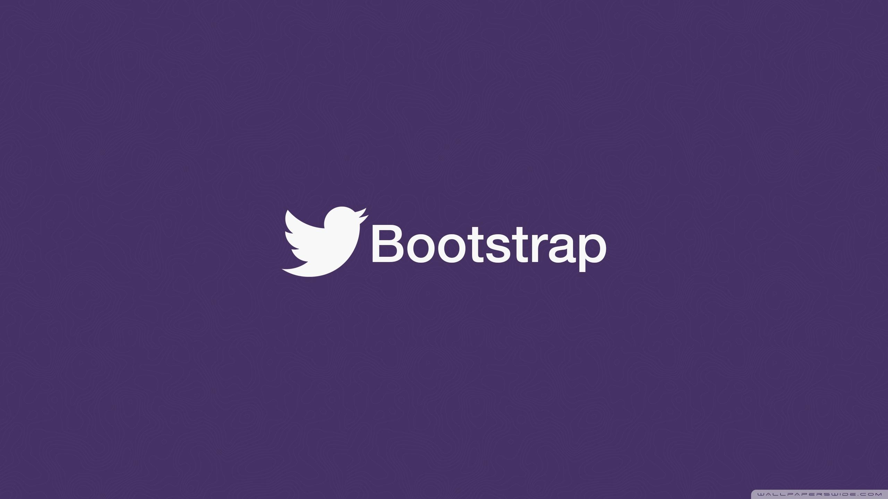
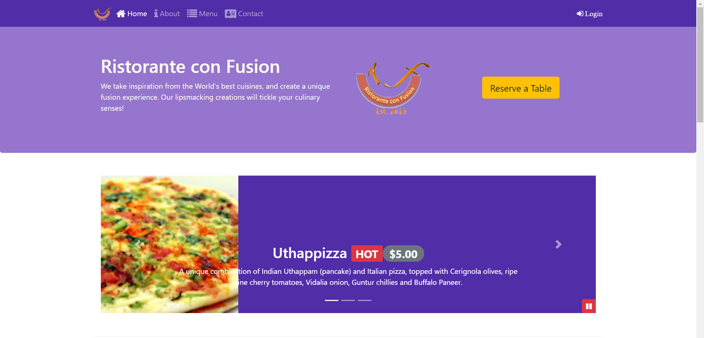
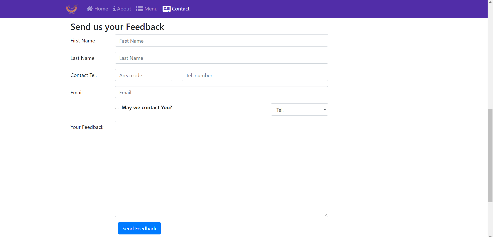
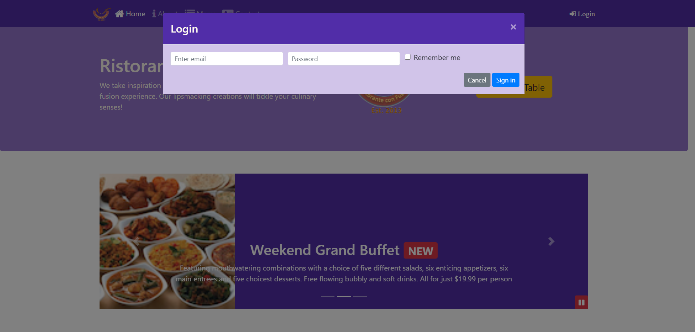

# Bootstrap 4 Web Course

Front-End Web UI Frameworks and Tools: Bootstrap 4
* [Course Link](https://www.coursera.org/learn/bootstrap-4)
# Getting Started
To get the Node server running locally:

- `npm install` to install all required dependencies
- `npm run dev` to start the local server

# Screenshots

# Dependencies 
- [gruntjs](https://gruntjs.com/) - Javascript Task Runner - The less work you have to do when performing repetitive tasks like minification, compilation, unit testing, linting, etc.
- [gulpjs](https://gulpjs.com/) - Javascript Task Runner
- [sass](https://sass-lang.com/) - CSS extension language
- [less](http://lesscss.org/) - CSS extension language

# Application Structure
- `package.json` - contains additional metadata
- `Gruntfile.js` - managing grunt file extensions
- `gulpfile.js` - managing gulp file extensions